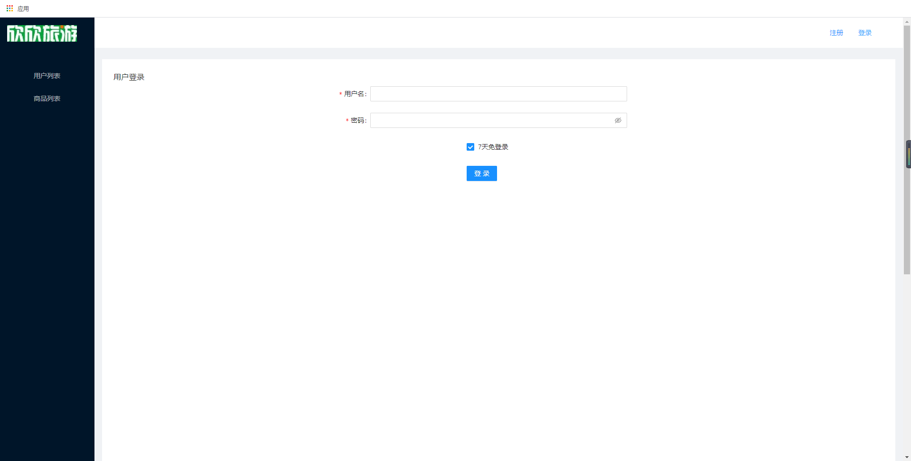
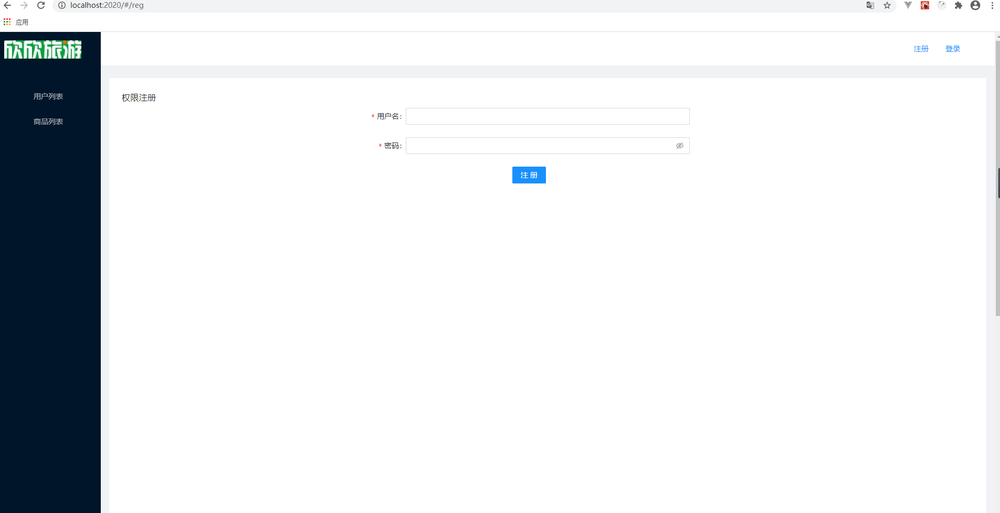
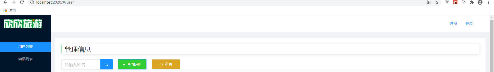
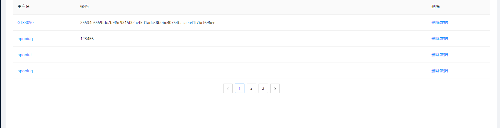
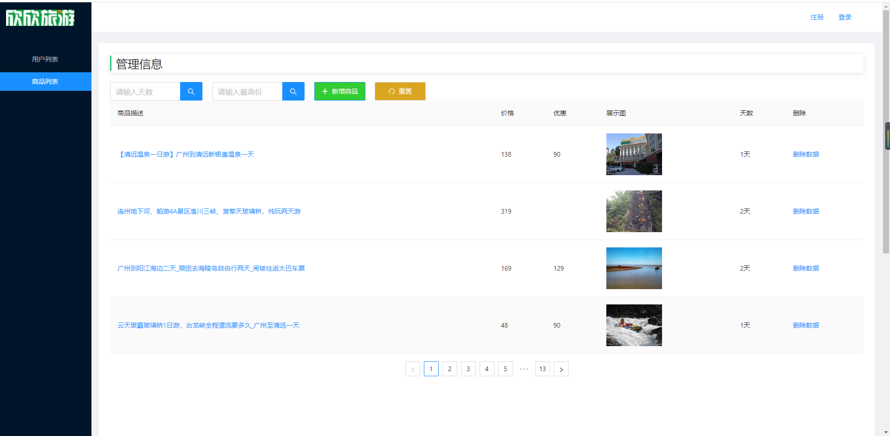
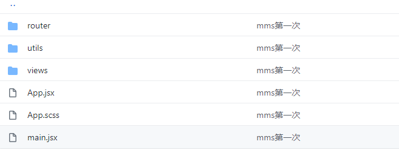

#欣欣旅游网后台管理系统 ##官网：https://www.cncn.com/
*上线网址：
*测试账号：（有注册系统注册即可）
*后台管理系统网址：
*Github 网址：https://github.com/gzh52004/Xinxin-Travel

---

##后台管理系统人员名单
*负责人：陈志远
*成员：陈志远，张剑熠
*分工：
*1.张剑熠：负责环境搭建，登录注册功能，以及用户管理、商品管理按钮组功能的实现
_;
_;
_;
\*2.陈志远：负责页面路由跳转的实现，以及用户管理、商品管理列表页渲染以及具体功能的实现
_;
\_;

---

#项目目录说明
\_;
*utils 是 axios 封装文件夹
*views 是功能组件模块
